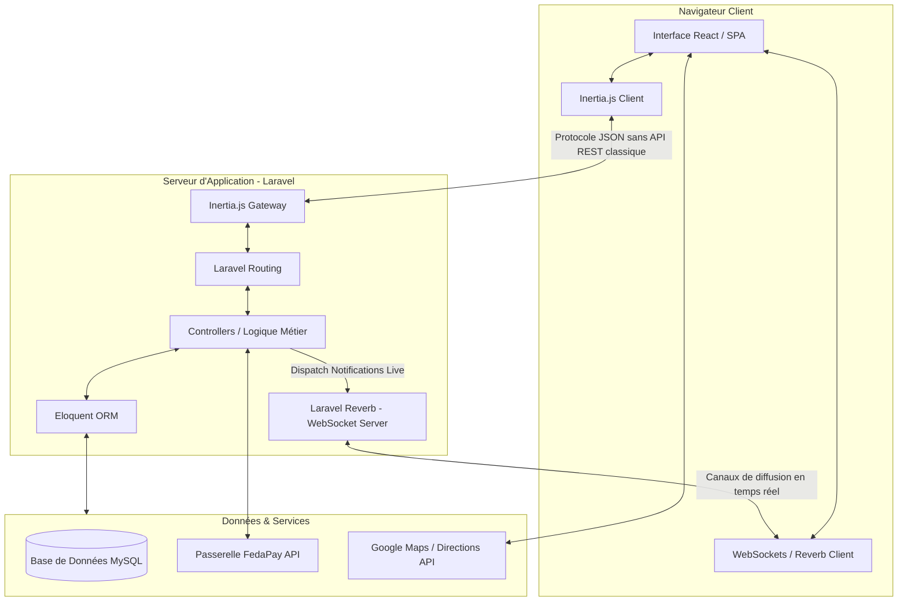
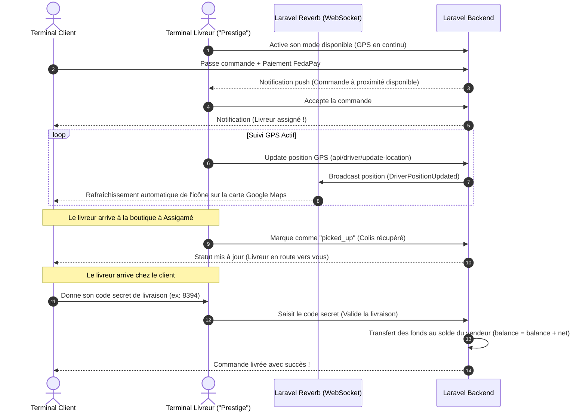

# GUIDE D'ARCHITECTURE TECHNIQUE DE LOMÉSHOP
## 📘 Référentiel Académique Complet pour la Rédaction du Mémoire de Fin d'Études

Ce document constitue le **guide d'architecture de référence** pour la rédaction de votre mémoire universitaire sur la plateforme **LoméShop**. Il a été conçu pour formaliser l'ensemble de la conception, de la modélisation des données, des choix technologiques et des flux logistiques innovants mis en place dans le projet, afin que vous puissiez directement les copier, vous en inspirer ou les présenter lors de votre soutenance de mémoire.

---

## 💻 1. Fiche Technique & Pile Technologique (Tech Stack)

Pour la rédaction de votre chapitre sur le **choix des technologies**, voici la justification académique et la structure de la pile retenue pour LoméShop.

### L'Architecture Modern Monolith (Laravel + Inertia.js + React)

Plutôt que d'adopter une architecture découplée classique (API REST séparée d'une application Single Page React) qui engendre une double maintenance, des problèmes de CORS et une complexité de déploiement, **LoméShop** repose sur l'approche **Modern Monolith** via **Inertia.js**.



### Avantages Majeurs à Valoriser dans le Mémoire :
1. **Élimination de la latence d'API REST** : Inertia.js permet à Laravel de renvoyer directement les propriétés (props) au composant React sans passer par un processus de sérialisation/désérialisation d'API complexes.
2. **Expérience utilisateur (UX) fluide** : La navigation est celle d'une application Single Page (SPA) ultra-rapide sans rechargement de page, tout en bénéficiant de la puissance et de la sécurité du routage et des sessions Laravel au niveau serveur.
3. **Temps Réel Natif** : L'intégration de **Laravel Reverb**, serveur WebSocket natif intégré au framework, élimine la dépendance à des services tiers payants (comme Pusher) et permet un suivi logistique et un tchat instantané hébergés localement.

---

## 🗄️ 2. Modèle Conceptuel et Relationnel des Données (MCD / MLD)

Voici les structures précises de vos tables MySQL avec leurs relations. Vous pouvez les utiliser pour générer vos diagrammes entité-association.

### Modélisation des Entités Principales

#### Table `users` (Gestion de l'identité multi-rôles)
Contient tous les acteurs de la plateforme. Le rôle (`client`, `seller`, `driver`, `admin`) détermine les permissions et les interfaces associées.

| Champ | Type | Description |
| :--- | :--- | :--- |
| `id` | BigInt (PK) | Identifiant unique de l'utilisateur. |
| `name` | String | Nom complet de l'utilisateur. |
| `email` | String (Unique) | Adresse e-mail de connexion. |
| `phone` | String | Numéro de téléphone pour les contacts et livraisons. |
| `role` | Enum | Rôle de l'utilisateur (`client`, `seller`, `driver`, `admin`). |
| `driver_status` | Enum | Disponibilité du livreur (`available`, `busy`, `offline`, `paused`). |
| `last_latitude` | Decimal(10,8) | Dernière position GPS connue (Livreur / Client). |
| `last_longitude`| Decimal(11,8) | Dernière position GPS connue (Livreur / Client). |
| `vehicle_type` | String | Type de véhicule du livreur (Moto, Voiture, etc.). |
| `vehicle_plate` | String | Plaque d'immatriculation (Livreur). |
| `license_image` | String | Chemin du fichier du permis de conduire (KYC). |

#### Table `shops` (Gestion des Boutiques / Artisans)
Chaque vendeur possède une boutique physique géolocalisée et soumise à vérification (KYC).

| Champ | Type | Description |
| :--- | :--- | :--- |
| `id` | BigInt (PK) | Identifiant unique de la boutique. |
| `user_id` | BigInt (FK) | Référence au propriétaire (table `users`). |
| `neighborhood_id`| BigInt (FK) | Référence au quartier de Lomé (table `neighborhoods`). |
| `name` | String | Nom commercial de la boutique. |
| `slogan` | String | Devise ou accroche publicitaire. |
| `latitude` | Decimal(10,8) | Coordonnées de localisation de la boutique physique. |
| `longitude` | Decimal(11,8) | Coordonnées de localisation de la boutique physique. |
| `balance` | Decimal(10,2) | Solde financier de la boutique (fonds disponibles). |
| `status` | Enum | État de la boutique (`pending`, `approved`, `rejected`). |
| `is_verified` | Boolean | Drapeau indiquant la réussite du KYC. |
| `id_card_path` | String | Pièce d'identité envoyée pour validation. |
| `license_path` | String | Enregistrement au registre du commerce (RCCM). |

#### Table `orders` (Gestion des Commandes et Logistique)
Représente la transaction et gère le workflow logistique.

| Champ | Type | Description |
| :--- | :--- | :--- |
| `id` | BigInt (PK) | Identifiant unique de la commande. |
| `user_id` | BigInt (FK) | Référence au client acheteur (table `users`). |
| `shop_id` | BigInt (FK) | Référence à la boutique vendeuse (table `shops`). |
| `driver_id` | BigInt (FK, Null) | Référence au livreur assigné (table `users`). |
| `order_number` | String | Code unique de suivi commercial (ex: CMD-2026-XXXX). |
| `total_amount` | Decimal(10,2) | Montant total payé par le client. |
| `commission_amount`| Decimal(10,2)| Commission prélevée par la plateforme (10% par défaut). |
| `seller_amount` | Decimal(10,2) | Montant net reversé au solde de la boutique. |
| `status` | Enum | Workflow : `pending`, `paid`, `processing`, `preparing`, `ready_for_pickup`, `picked_up`, `delivered`, `cancelled`. |
| `delivery_address`| String | Adresse textuelle saisie par le client. |
| `delivery_code` | String | Code secret à 4 chiffres généré à la commande, à fournir au livreur à la remise du colis pour sécuriser la livraison. |
| `payment_reference`| String | ID de transaction retourné par FedaPay. |

#### Entités de Communication : `conversations` et `messages`
Permet la messagerie instantanée instantanée (WhatsApp-like) entre Clients et Boutiques en temps réel.
- `conversations` : Relie un `user_id` (Client) et un `shop_id` (Vendeur).
- `messages` : Contient l'`id` du message, le `conversation_id`, le `sender_id`, le `content` (le texte) et le `read_at` (pour accuser de réception).

---

## 🗺️ 3. L'Écosystème de Suivi Logistique en Temps Réel

Le cœur d'innovation logistique de LoméShop repose sur l'interaction dynamique entre **trois terminaux mobiles** via WebSockets :



### Mécanisme Technologique d'Estimation d'Itinéraire
Dans le fichier Tracking.jsx, l'application utilise l'API **DirectionsService** de Google Maps pour tracer dynamiquement deux itinéraires distincts :
1. **Étape 1** : De la position en temps réel du livreur vers la boutique physique (ex: Grand Marché d'Assigamé).
2. **Étape 2** : De la boutique vers la position GPS actuelle de l'appareil mobile du client (géolocalisation live du navigateur).

Cela résout le problème de l'adressage imprécis à Lomé en combinant **points de repère fixes** (boutique) et **coordonnées dynamiques** (client).

---

## 💰 4. Modèle Économique, KYC et Flux Financiers

LoméShop intègre un module de gestion de portefeuille et de conformité réglementaire (KYC) conçu pour rassurer les banques et institutions financières.

### Processus d'Onboarding Vendeur & Retraits
1. **Soumission de KYC** : Le vendeur crée un compte boutique et téléverse sa carte d'identité ou passeport (`id_card_path`) et sa licence commerciale (`license_path`).
2. **Vérification Administrateur** : L'administrateur valide le dossier dans son tableau de bord d'administration globale (`Verify KYC`). La boutique passe à l'état `approved` et ses produits deviennent visibles publiquement.
3. **Paiement Mobile Money / Cartes** : Le client paie via la passerelle **FedaPay**, qui gère nativement **TMoney** et **Flooz** au Togo, ainsi que les cartes Visa/Mastercard.
4. **Calcul de Commission** :
   $$\text{Montant Client} = \text{Sous-total} + \text{Frais de livraison}$$
   $$\text{Commission Plateforme (10\%)} = \text{Sous-total} \times 0.10$$
   $$\text{Net Vendeur} = \text{Sous-total} - \text{Commission}$$
5. **Demande de Retrait** : Le vendeur peut demander à retirer son solde accumulé (`balance`) vers son compte Mobile Money depuis son dashboard Wallet.jsx. L'administrateur valide la transaction après vérification du solde réel.

---

## 📝 5. Plan de Rédaction Détaillé pour Votre Mémoire (100-120 Pages)

Voici le plan académique idéal, structuré selon les normes universitaires pour un mémoire en Ingénierie Logicielle / Systèmes d'Information.

```
INTRODUCTION GÉNÉRALE
    - Contexte de l'étude (Émergence du e-commerce en Afrique subsaharienne et au Togo).
    - Problématique (Absence d'adressage précis, méfiance face aux paiements en ligne, logistique informelle à Lomé).
    - Objectifs du projet LoméShop.
    - Structure du document.

CHAPITRE I : ÉTUDE PRÉALABLE ET ANALYSE DES BESOINS
    1.1 Présentation de l'environnement d'étude (Le secteur commercial de Lomé).
    1.2 Analyse de l'existant et critique (Systèmes actuels de livraison et leurs limites).
    1.3 Spécification des besoins fonctionnels
        - Besoins du Client (Achat, géolocalisation, paiement mobile, suivi en temps réel).
        - Besoins du Vendeur (Gestion de vitrine, comptabilité simplifiée, messagerie directe).
        - Besoins du Livreur (Routage dynamique, gestion des courses).
        - Besoins de l'Administrateur (Gestion des flux de trésorerie, modération KYC).
    1.4 Spécification des besoins non fonctionnels (Sécurité, performance, tolérance aux pannes réseaux mobiles).

CHAPITRE II : CONCEPTION ET MODÉLISATION DU SYSTÈME
    2.1 Méthodologie de conception (UML ou MERISE).
    2.2 Diagrammes de cas d'utilisation (Acteurs et interactions).
    2.3 Diagrammes de séquence système (Flux de commande, flux de suivi GPS en temps réel).
    2.4 Modélisation des données
        - Dictionnaire des données.
        - Modèle Conceptuel des Données (MCD) et règles de gestion.
        - Modèle Relationnel des Données (MLD).
    2.5 Architecture logicielle globale (Modèle MVC hybride avec InertiaJS).

CHAPITRE III : ARCHITECTURE TECHNIQUE ET CHOIX TECHNOLOGIQUES
    3.1 Justification du choix de la pile logicielle
        - Pourquoi Laravel en backend (Sécurité, maturité, écosystème).
        - Pourquoi React en frontend (Composants réutilisables, DOM virtuel ultra-rapide).
        - Pourquoi InertiaJS (Liaison native sans la lourdeur d'une API découplée).
    3.2 La gestion du Temps Réel avec Laravel Reverb (Protocole WebSocket).
    3.3 L'intégration logistique (Services géographiques Google Maps et géolocalisation HTML5).
    3.4 La passerelle de paiement FedaPay (Intégration TMoney, Flooz et conformité réglementaire).

CHAPITRE IV : IMPLÉMENTATION ET RÉSULTATS
    4.1 Structure du projet (Organisation du code source).
    4.2 Présentation des interfaces utilisateurs (Captures d'écran commentées)
        - L'espace Boutique (Onboarding, KYC et catalogue produit).
        - L'espace Client (Recherche sur carte, Tunnel de checkout, Messagerie instantanée).
        - Le Dashboard Livreur "Prestige" (Acceptation et guidage cartographique).
        - La console d'administration financière.
    4.3 Algorithmes clés (Sécurisation par code de livraison secret, synchronisation GPS asynchrone).

CHAPITRE V : TESTS, DÉPLOIEMENT ET SÉCURISATION
    5.1 Stratégie de tests (Tests unitaires, tests d'intégration, simulations de trajectoires GPS).
    5.2 Gestion de la performance et du cache (Résolution du problème de mise en cache du navigateur Chrome pour les ressources statiques).
    5.3 Déploiement et intégration continue (CI/CD, configuration du serveur web, supervision Reverb).
    5.4 Analyse de la sécurité (Protection CSRF, filtrage des rôles par middleware Laravel, chiffrement des données de paiement).

CONCLUSION GÉNÉRALE ET PERSPECTIVES
    - Synthèse du travail accompli.
    - Apports personnels et professionnels.
    - Limites actuelles du système.
    - Perspectives futures (Intelligence artificielle pour le routage prédictif, extension à d'autres villes du Togo).
```

---

## 🎓 6. Stratégie de Présentation de la Soutenance (Oral Defense)

Pour briller devant le jury de soutenance, voici **3 éléments différenciateurs** à mettre en avant :

1. **La démonstration en temps réel du Livreur** : 
   Montrez comment le livreur active sa disponibilité sur son téléphone et comment son icône se déplace instantanément sur l'écran du client sans aucun rechargement. C'est l'argument "effet wow" technologique.
2. **La résolution pragmatique du problème d'adressage à Lomé** : 
   Expliquez que le système ne repose pas sur des codes postaux (inexistants) ou de simples saisies de texte vagues, mais sur la capture en direct des coordonnées GPS de l'appareil mobile de l'acheteur combinée à la localisation cartographique précise de la boutique physique.
3. **L'inclusion financière locale** : 
   Insistez sur l'intégration de **TMoney** et **Flooz** via **FedaPay**. En Afrique de l'Ouest, concevoir une application de livraison uniquement par carte de crédit est un échec assuré. LoméShop démontre une adéquation totale avec le marché cible en se basant sur le Mobile Money.
